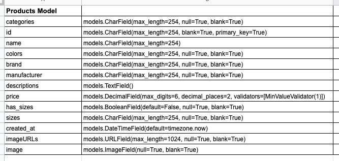
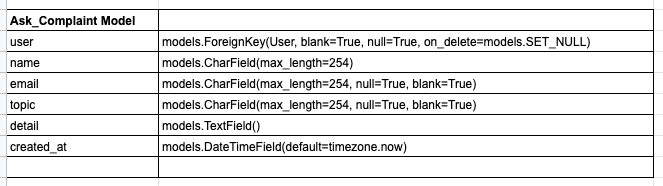
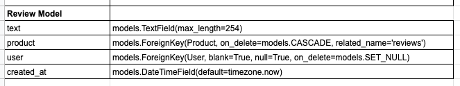

Shop-Bata is an online shoe store designed to provide a seamless and satisfying 
shopping experience to customers with specific interest in mens shoes. 
Shop-Bata is an intuitive and simplified website, built to engage prospective 
customers and also re-engage existing customers. 

Shop-Bata was designed by Olusegun Ayodele as his final milestone project at 
Code Institute Full-stack Web Development Diploma course.

## UX
### Users Goal
* To get user friendly online shopping experience. 
* To experience frictionless product browsing and secured payment process.
* To shop on a site that is known for the peculiarity of its product range.

### Business Goal
* To offer impeccable online shopping experience, resulting in customer satisfaction and retention.
* To build customer confidence and trust through assurance of privacy and data security.
* To provide ease of transaction for customers without the limitation of distance and time.
* To capture customers information for marketing analysis and research purposes.

### User Story
#### Persona
Jadon is a 26 years old associate lawyer at a law firm, his boss, who is also his friend, 
is celebrating his birthday in one week. He has decided to get him a shoe as his birthday 
gift, hence needs an online store that deals specifically in mens shoes.

* Jadon visits Shop Bata to shop for quality men's shoes. 
* He finds exquisite shoes at great prices and there also, decides to buy one for himself.
* He registers on Shop Bata's website and places the order.

### Design Choice

**Fonts**
* Lato
* Pacifico

**Colour**

**WireFrame**
* Desktop view

* Mobile view

## Features
### Existing Features
* __Navbar__ This is featured on every page of the website and contains brand name, links for 
sorting and navigating through the products. Also featured in the navigation are, the shopping cart, 
user profile, register and login links.

* __Search engine__ This can be used to filter down to specific results as it returns search inputs that matches
 either product name, description or category. The search engine is featured on all the pages of the website.

 * __footer__ is also featured on all the pages of the site, which cantains links to other parts of the website. Aslo
 contained in the footer is the contact information of the Shop Bata.

 * __Product page__ This is where all the products are displayed, with the most recent listed on the top of the product page. 
 Each product is displayed in a card that features the product image, price and brand, the product images are links to 
 the selected product on a click, opening the selected product page for more details about the product. On the selected 
 product page, quantity and size selection functionalities are featured with buttons to select product(s) to the 
 shopping cart or return to the main product page. 
 

 * __Product review__ Allows a logged in customer to write a review about  selected product, which will be visible to 
 every other customer that visits the product after then.

* __Authentication__ This consists of the login and register page, and also gives access to the user profile page. On the 
register page, some basic information such as username, email and password are required to sign up, creating a user 
profile for the customer. On the sign in page, username and password are required of the customers, provided they 
have already signed up before.

* __Shopping cart__ This collects records of products selected by customers while shopping, displaying the total cost 
of all the products added to the cart. The shopping cart contains a button that links the checkout page and another 
that links the product page, in case the customer wishes to continue shopping.

* __Checkout page__ The checkout page is a secured page where the order is placed and payment is made. Featured on the 
checkout page is a requirement for some information from the customer to facilitate delivery. There is also a secured 
card payment functionality powered by Stripe. When an order is successfully placed, a 'Thank You' page is displayed 
with order details and a confirmation email sent to the customer.

* __Notification messages__ This is an intuitive messaging functionality used to communicate with the customer, 
it informs the customer of action, error warnings or confirms a successful action.

* __Ask question | Complaint page__ This page features a form that a logged in customer can use to ask the admin 
a question or lodge complaint.

* __User profile__ The user profile page contains the information of the logged in customer in a form with an 
update profile button at the bottom of the form. Also featured on the user profile page is order history of the 
logged in customer.

## Information Architecture

**Products Model**

**Asl/Complaint Model Model**

**Asl/Complaint Model Model**

## Technology Used

### Tools
* __Adobe Illustrator__ used for wireframe design.
* __Adobe Photoshop__ used for image resize and compression.
* __Git__ for version control
* __GitHub__ used to store and share project code remotely.
* __Heroku__ for hosting of the website.
* __Coolors.co__ for color palette generation.
* __Stripe__ payment infrastructure used to validate and accept card payments securely.
* __Django__ python web framework for fast development and professional design.

### Libraries
* [Bootstrap](https://getbootstrap.com/) To simplify the responsiveness and the structure of the website.
* [Google Fonts](https://fonts.google.com/) for font styling.
* [jQuery](https://jquery.com/) To simplify DOM manipulation.
* [Font Awasome](https://fontawesome.com/) To incorporate icons.
* [Jinja Framework](https://jinja.palletsprojects.com/en/2.11.x/) Used for template execution and code re-usability.

### Programming Languages
* HTML
* CSS 
* Javascript
* Python

### Database
* PostgreSQL
* Sqlite#
* AWS S3

## Test
All the app on Shop Bata has been tested out every functionality works as intended. The navition links featured on 
every page of the site links the intended pages.
Shop Bata website was manually tested, the functionality and the navigation was tested as follows.
As a customer looking to buy shoes;
* I entered Shop Bata url into my browser and it opens the landing page.
* On the landing page, I clicked the Shop Now button and it linked the products page.
* I browsed the products using the filter options in the menu bar, and got results as expected.
* I also searched using either name, description or or category to search for product and search 
results were returned accordingly.
* I clicked a product to view more details and it opens the selected product page with more 
details and reviews about the product.
* I clicked add to cart button and I got a notification message that product was added to cart successfuly.
* After selecting a few more products, I clicked the shopping cart button on the menu bar and 
the shopping cart page opened with the list of my selected products and their total cost.
* I then clicked the checkout button and a page with a form and card payment input opened.
* I filled in the required details and completed the checkout, and a confirmation page opens 
with details of the order.
* A confirmation email was sent to me as stated on the confirmation page.
* I then opened the register page and sign up on the website.
* I opened the Ask question form and filled to ask for an update on a formally listed product.

The following tools were used to validate and beautify the codes:
* [Freeformatter](https://www.freeformatter.com/html-formatter.html#ad-output) used to beautify the HTML code.
* [BeautyTools](http://beautifytools.com/css-validator.php) used to beautify and validate the Javascript and CSS codes.

### Limitations
* Lost password recovery funxtionality is a feature not yet implemented on Shop Bata
* Customer care chat functionality is not feateured yet on this site.

## Deployment
Shop Bata is deployed on Heroku and the following steps were taken during deployment;

* Sign up on Heroku and create app to host the project code
* Create a free plan of  PosgreSQL database
* Install dj-database-url and psycho2-binary
* Setup the setting of the database on settings.py
* Install all necessary plugins and freeze requirements.txt to ensure heroku runs properly
* Ensure all sensitive key are save in .env or env.py and also ensure they are saved on 
environment variable in Heroku. See requirements.txt
* Connect Heroku to repository on Heroku for automatic deployment.
* Create AWS account and open S3, create group user and generate policy
* Create S3 bucket to hold all the static and image files.
* Connect S3 to repository and Heroku with AWS keys.
* Commit and push from your repository, and confirm your images and static are loadrd on AWS.
* To run on gitpod ensure all the plugin listed on requirements.txt is installed and DEVELOP equals True
* Ensure all fixtures are loaded with 'python3 manage.py loaddata <fixturename>'
* Ensure all models are migrated when created and also after any chenges are made on them.

## Credits
### Media
* All product and image urls use on this project were sourced from Zalando.se 
while the landing page image was gotten from 
https://tblon.com/blogs/news/wingtip-shoes-relaxed-and-stylish
    

## Acknowledgement
Shop Bata was inspired by Ado Boutique project, and the templates 
and views codes were modelled after Ado Boutique with some modification, 
except for the models, and some functionalities that were not implemented 
in Boutique Ado. 
The following videos were very instrumental in implementing django;
* [Animate on scroll](https://www.youtube.com/watch?v=ptfUwPJbGlQ/)
* [Django pagination](https://www.youtube.com/watch?v=Z8MDdDyB_6A&t=447s/)
* [Django datetime](https://www.youtube.com/watch?v=Lyq7Bn4c6Kc/)

Special thanks to Code Institute Student Care team for their guidance and advises throughout all the projects and the lessons especially 
Sheryl,for her patience intentionality to help out.
I also want to thank my mentor Jonathan Munz, for his advises and encuragement all through the program.

I recieved inspiration and references from the following sources:
* [Adidas](https://www.adidas.com/us/men-shoes/)
* [Gucci](https://www.gucci.com/se/en_gb/ca/men/shoes-for-men-c-men-shoes/)