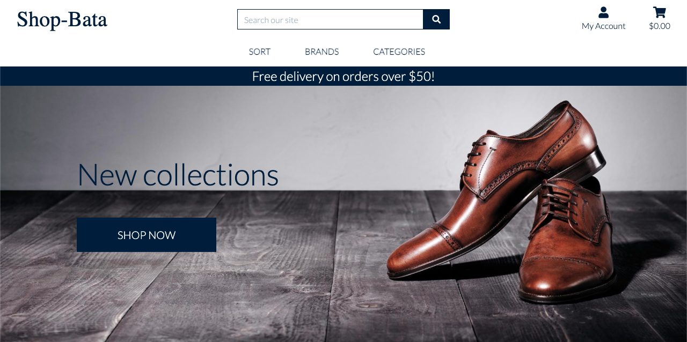
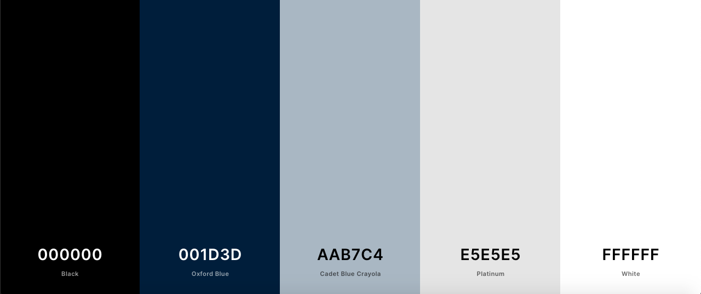
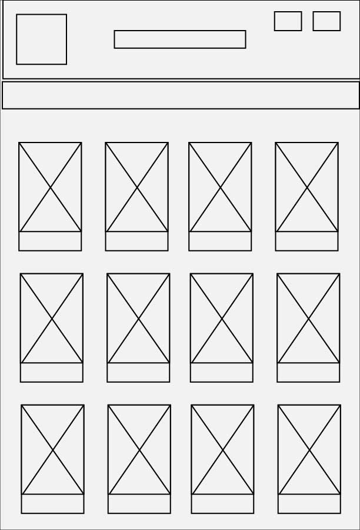
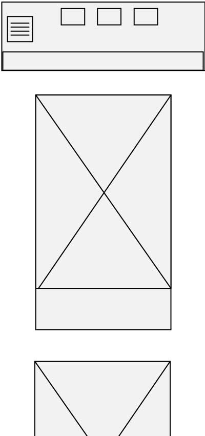
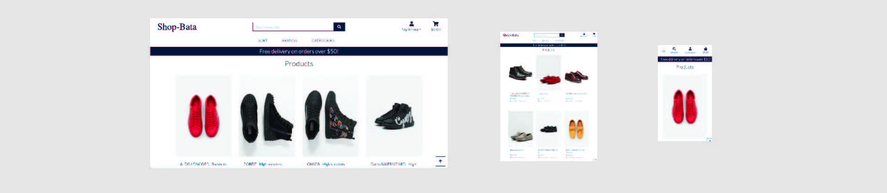

Shop-Bata is an online shoe store designed to provide a seamless and satisfying 
shopping experience to customers with specific interest in mens shoes. 
Shop-Bata is an intuitive and simplified website, built to engage prospective 
customers and also re-engage existing customers. 

Shop-Bata was designed by Olusegun Ayodele as his final milestone project at 
Code Institute Full-stack Web Development Diploma course.

## UX
### Users Goal
* To get user friendly online shopping experience. 
* To experience frictionless product browsing and secured payment process.
* To shop on a site that is known for the peculiarity of its product range.

### Business Goal
* To offer impeccable online shopping experience, resulting in customer satisfaction and retention.
* To build customer confidence and trust through assurance of privacy and data security.
* To provide ease of transaction for customers without the limitation of distance and time.
* To capture customers information for marketing analysis and research purposes.

### User Story
#### Persona
Jadon is a 26 years old associate lawyer at a law firm, his boss, who is also his friend, 
is celebrating his birthday in one week. He has decided to get him a shoe as his birthday 
gift, hence needs an online store that deals specifically in mens shoes.

* Jadon visits Shop Bata to shop for quality men's shoes. 
* He finds exquisite shoes at great prices and there also, decides to buy one for himself.
* He registers on Shop Bata's website and places the order.

### Design Choice

**Fonts**
* Lato
* Pacifico

**Colour**

**WireFrame**
* Desktop view

* Mobile view

## Features
### Existing Features
* __Navbar__ This is featured on every page of the website and contains brand name, links for 
sorting and navigating through the products. Also featured in the navigation are, the shopping cart, 
user profile, register and login links.

* __Search engine__ This can be used to filter down to specific results as it returns search inputs that matches
 either product name, description or category. The search engine is featured on all the pages of the website.

 * __Product page__ This is where all the products are displayed, with the most recent listed on the top of the product page. 
 Each product is displayed in a card that features the product image, price and brand, the product images are links to 
 the selected product on a click, opening the selected product page for more details about the product. On the selected 
 product page, quantity and size selection functionalities are featured with buttons to select product(s) to the 
 shopping cart or return to the main product page. 
 

* __Authentication__ This consists of the login and register page, and also gives access to the user profile page. On the 
register page, some basic information such as username, email and password are required to sign up, creating a user 
profile for the customer. On the sign in page, username and password are required of the customers, provided they 
have already signed up before.

* __Shopping cart__ This collects records of products selected by customers while shopping, displaying the total cost 
of all the products added to the cart. The shopping cart contains a button that links the checkout page and another 
that links the product page, in case the customer wishes to continue shopping.

* __Checkout page__ The checkout page is a secured page where the order is placed and payment is made. Featured on the 
checkout page is a requirement for some information from the customer to facilitate delivery. There is also a secured 
card payment functionality powered by Stripe. When an order is successfully placed, a 'Thank You' page is displayed 
with order details and a confirmation email sent to the customer.

* __Notification messages__ This is an intuitive messaging functionality used to communicate with the customer, 
it informs the customer of action, error warnings or confirms a successful action.

* __User profile__ The user profile page contains the information of the logged in customer in a form with an 
update profile button at the bottom of the form. Also featured on the user profile page is order history of the 
logged in customer.

## Technology Used

### Tools
* __Adobe Illustrator__ used for wireframe design.
* __Adobe Photoshop__ used for image resize and compression.
* __Git__ for version control
* __GitHub__ used to store and share project code remotely.
* __Heroku__ for hosting of the website.
* __Coolors.co__ for color palette generation.
* __Stripe__ payment infrastructure used to validate and accept card payments securely.
* __Django__ python web framework for fast development and professional design.

### Libraries
* [Bootstrap](https://getbootstrap.com/) To simplify the responsiveness and the structure of the website.
* [Google Fonts](https://fonts.google.com/) for font styling.
* [jQuery](https://jquery.com/) To simplify DOM manipulation.
* [Font Awasome](https://fontawesome.com/) To incorporate icons.
* [Jinja Framework](https://jinja.palletsprojects.com/en/2.11.x/) Used for template execution and code re-usability.

### Programming Languages
* HTML
* CSS 
* Javascript
* Python

### Database
* PostgreSQL
* Sqlite#
* AWS S3

## Test
The following tools were used to validate and beautify the codes:
* [Freeformatter](https://www.freeformatter.com/html-formatter.html#ad-output) used to beautify the HTML code.
* [BeautyTools](http://beautifytools.com/css-validator.php) used to beautify and validate the Javascript and CSS codes.

The navigation and buttons on this website has been tested, navigations all links to indended pages and the buttons 
functions as expected.
The authentication requires an email and password to login, giving access to more functionalities and pages such as user profile,
update profile, list items, update and deleting of items listed by same user.
This website database is mongoDB and all the endpoints created to carry out CRUD operations works properly; registered 
users of this website can create, read, update and delete data in the database.

### Limitations
* Marketsquare does not have location feature therefore can not connect buyer and seller based on proximity.
* Marketsquare requires authentication for only buyers therefore there is no chat functionality between a buyer and seller.
* There is no shopping cart functionality currently on Marketsquare website.

## Deployment
Hope Diagnostics is deployed and hosted on github pages.
At the setup stage of this project, it was connected to Heroku such that every Git push automatically updates on Heroku.
Files required by Heroku such as Procfile and requirements.txt have been added.
On the deployment page, GitHub is selected as the method, then deploy button was clicked for it to build and generate url.

## Credits
### Media
* All product images and urls use on this project was sourced from Zalando.se while the landing page image was gotten from https://tblon.com/blogs/news/wingtip-shoes-relaxed-and-stylish
    * [Pexels](https://www.pexels.com/)

## Acknowledgement

Special thanks to my mentor Jonathan Munz for his guidance and advises through this project and also projects.
I also want to thank my personal tutor Yeku Chetat for his patience, taking time to explain and answer my many questions.

I recieved inspiration and references from the following sources:
* [Adidas](https://www.adidas.com/us/men-shoes/)
* [Gucci](https://www.gucci.com/se/en_gb/ca/men/shoes-for-men-c-men-shoes/)